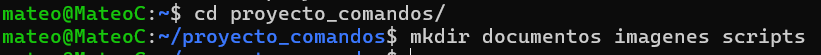
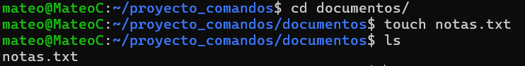
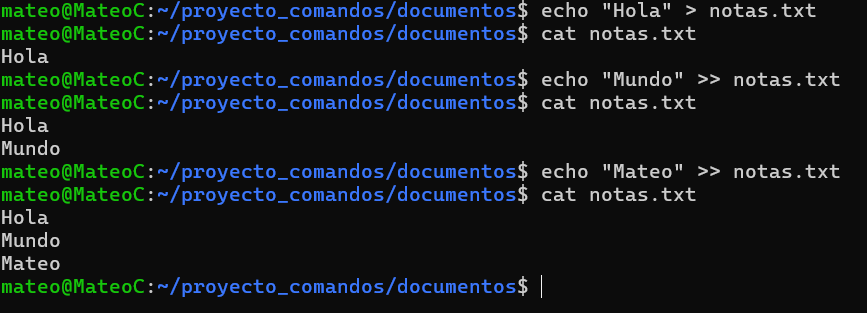
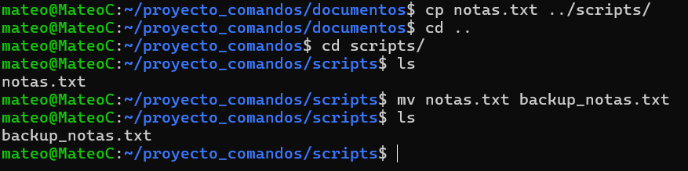
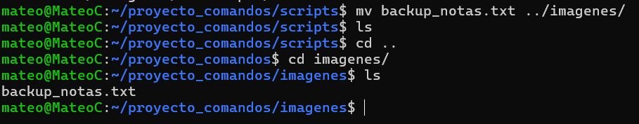
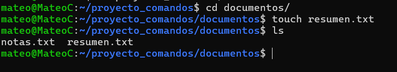
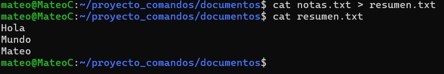
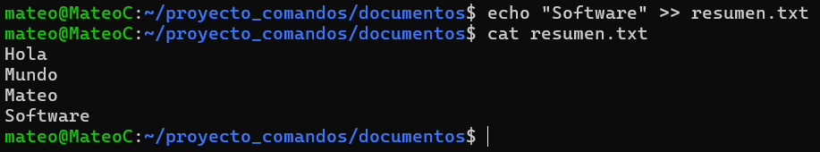
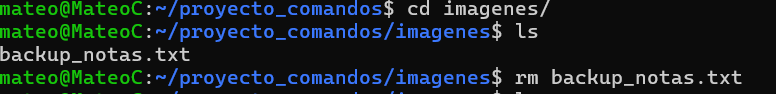
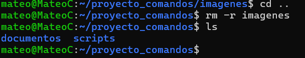

# Practica servidor web
## 1. Titulo
Titulo desciptivo a la practica realizada
## 2. Tiempo de duración
Tiempo en minutos usados para desarrollar la práctica 
## 3. Fundamentos:

Descripción de los conceptos para poder entender la practica, de al menos una *300* palabras, uso obligatorio de imágenes que ayuden la descripción de la teoría.

## 4. Conocimientos previos.
   
Para realizar esta practica el estudiante necesita tener claro los siguientes temas:
- Comandos lux.
- Manejo de navegador
- etc, etc

## 5. Objetivos a alcanzar
   
- Implementar contenedores con nginx…..
- Manipular archivos de configuración…..
  
## 6. Equipo necesario:
  
- Computador con sistema operativo Windows/Linux/Mac ...
- Cuenta en docker play....
- Docker v xxxx
- etc.

## 7. Material de apoyo.
   
- Documentacion de docker.
- Guia de asignatura.
- Cheat sheet linux
- etc
  
## 8. Procedimiento

### Crear una estructura de carpetas

<li>Paso 1: Crear carpeta de nombre proyecto_comandos</li>

  

<li>Paso 2: Crear 3 subcarptas: documentos,imagenes y scripts</li>

  

### Manipulación de Archivos

<li>Paso 1: Crear un archivo notas.txt adentro de la carpeta documentos </li>

  

<li>Paso 2: Agregar al menos tres líneas de texto en notas.txt  </li>

  

<li>Paso 3: Copiar el archivo notas.txt a la carpeta scripts y cambia su nombre a backup_notas.txt.</li>

  

<li>Paso 4: Mover el archivo backup_notas.txt a la carpeta imágenes.
</li>

  

### Redirección y concatenación 

<li>Paso 1: Crea un archivo llamado resumen.txt en documentos.
</li>

  

<li>Paso 2: Redireccionar el contenido de notas.txt a resumen.txt.

</li>

  

<li>Paso 3: Añadir una nueva línea de texto a resumen.txt sin sobrescribir su contenido.
</li>

  

### Eliminación de archivos y carpetas
<li>Paso 1:  Eliminar el archivo backup_notas.txt de la carpeta imágenes.

</li>

  

<li>Paso 2:  Elimina la carpeta imágenes (solo si está vacía).

</li>

  

## 9. Resultados esperados:
    
Descripcion de los resultados, capturas de pantallas del resultado final de la practica

## 10. Bibliografía
    
- Apellido,..... En apa