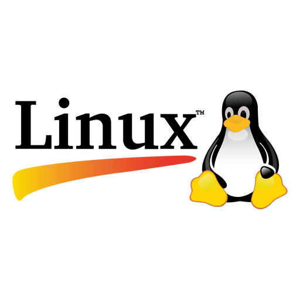

# Comandos Linux
## 1. Titulo
Manejo Básico de Comandos en Linux: "Creación y manipulación de archivos y directorios".
## 2. Tiempo de duración
90 minutos 
## 3. Fundamentos:

Linux es un sistema operativo basada en la linea de comandos, lo que significa que la mayoria de las interacciones con el sistema se realizan a través de comandos escritos. Estos comandos permiten al usuario realiza tareas como navegar por directorios, crear y manipular archivos, administrar permisos y ejecutar programas. 

  

 #### Comandos para la manipulación de archivos y directorios

 - **mkdir:** Se utiliza para la creacion de directorios.
 - **touch:** Se utiliza para crear un archivo vacio. 
 - **cp**: Se utiliza para copiar archivos o directorios.
 - **mv**: Se utiliza para mover o renombrar archivos o directorios.
 - **rm**: Elimina archivos o directorios.  

#### Redirección y concatenación 

    Es una característica que permite enviar la salida de un comando a un archivo o otro comando. Esto es util cuando queremos almacenar resultados o encadenar comandos. 

      > : Redirige la salida de un comando a un archivo. Si el archivo ya existe, su contenido se sobrescribe.
      >> : Agrega (sin sobrescribir) la salida de un comando a un archivo. 
      cat: Muestra el contenido de un archivo o lo concatena con otros archivos.

#### Eliminacion de archivos o directorios

    

      rm: Elimina archivos.
      rmdir: Elimina directorios vacios.
      rm -r: Elimina directorios y su contenido.

         

## 4. Conocimientos previos.
   
- Comandos Linux básicos.
- Manejo de terminal o consola.
- Conocimiento básico de manejo de directorios en sistemas operativos basados en UNIX.

## 5. Objetivos a alcanzar
   
- Crear y manipular directorios y archivos mediante comandos Linux.
- Aplicar redirección y concatenación de archivos en la terminal.
- Eliminar archivos y directorios correctamente.

  
## 6. Equipo necesario:
  
- **Computadora con sistema operativo Windows/Linux/Mac:** Se utilizó el sistema operativo Linux en una máquina con Ubuntu, pero también se puede realizar la práctica en otros sistemas operativos que tengan acceso a una terminal compatible con los comandos de Linux.

- **Terminal de Linux:** La terminal es esencial para realizar las operaciones, ya que la práctica se realizó completamente mediante línea de comandos.

- **Editor de texto:** Se emplearon editores de texto como nano o vim para modificar los archivos creados durante la práctica.

- **Red de Internet:** Para consultar la documentación de los comandos y obtener material adicional de apoyo, como tutoriales y guías en línea.

## 7. Material de apoyo.
   
- Documentacion de Linux.
- Guia de asignatura.
- Cheat sheet linux

  
## 8. Procedimiento

### Crear una estructura de carpetas

<li>Paso 1: Crear carpeta de nombre proyecto_comandos</li>

  

<li>Paso 2: Crear 3 subcarptas: documentos,imagenes y scripts</li>

  

### Manipulación de Archivos

<li>Paso 1: Crear un archivo notas.txt adentro de la carpeta documentos </li>

  

<li>Paso 2: Agregar al menos tres líneas de texto en notas.txt  </li>

  

<li>Paso 3: Copiar el archivo notas.txt a la carpeta scripts y cambia su nombre a backup_notas.txt.</li>

  

<li>Paso 4: Mover el archivo backup_notas.txt a la carpeta imágenes.
</li>

  

### Redirección y concatenación 

<li>Paso 1: Crea un archivo llamado resumen.txt en documentos.
</li>

  

<li>Paso 2: Redireccionar el contenido de notas.txt a resumen.txt.

</li>

  

<li>Paso 3: Añadir una nueva línea de texto a resumen.txt sin sobrescribir su contenido.
</li>

  

### Eliminación de archivos y carpetas
<li>Paso 1:  Eliminar el archivo backup_notas.txt de la carpeta imágenes.

</li>

  

<li>Paso 2:  Elimina la carpeta imágenes (solo si está vacía).

</li>

  

## 9. Resultados

Al finalizar la práctica, se verificó que las operaciones de creación, manipulación, redirección, concatenación y eliminación de archivos se realizaron correctamente, obteniendo los siguientes resultados:

### Manipulación de archivos
- Se creó la carpeta `proyecto_comandos` con las subcarpetas `documentos`, `imagenes` y `scripts`.
- Dentro de `documentos`, se generó el archivo `notas.txt` y se añadieron tres líneas de texto correctamente.
- Se copió `notas.txt` a `scripts` y se renombró como `backup_notas.txt`.
- `backup_notas.txt` fue movido correctamente a la carpeta `imagenes`.

### Redirección y concatenación
- Se creó el archivo `resumen.txt` dentro de `documentos`.
- Se redirigió el contenido de `notas.txt` a `resumen.txt`, verificando que el contenido era el mismo.
- Se añadió una nueva línea a `resumen.txt` sin sobrescribir el contenido previo.

### Eliminación de archivos y carpetas
- Se eliminó `backup_notas.txt` de `imagenes`.
- Se eliminó la carpeta `imagenes` después de confirmar que estaba vacía.

Según los resultados obtenidos, podemos concluir que la práctica se completó con éxito, demostrando el uso de comandos básicos de manipulación de archivos en Linux.

## 10. Bibliografía  

Maguaman, M. (2024). *Gist Semana 1 - Comandos básicos Linux*. GitHub.  
Disponible en [https://github.com/maguaman2/tendencias-tecnologicas/blob/main/gist-semana1-comandos-basicos-linux.md](https://github.com/maguaman2/tendencias-tecnologicas/blob/main/gist-semana1-comandos-basicos-linux.md)  

Microsoft. (2024). *Instalar WSL en Windows*. Microsoft Docs.  
Disponible en [https://learn.microsoft.com/es-es/windows/wsl/install](https://learn.microsoft.com/es-es/windows/wsl/install)  

The Linux Foundation. (2024). *Introducción a Linux*.  
Disponible en [https://www.linuxfoundation.org/](https://www.linuxfoundation.org/)  
